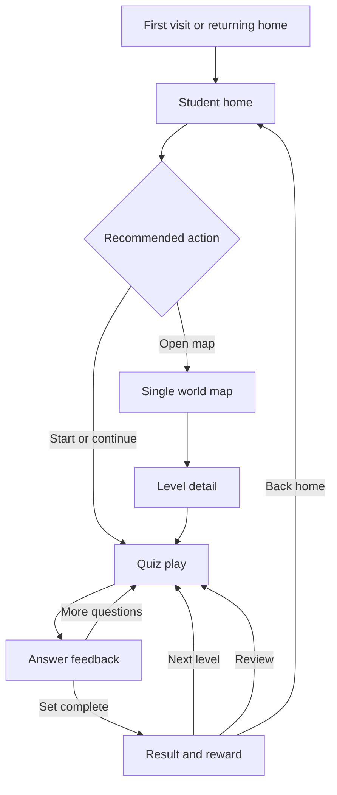

# Week 3 Navigation Model

Date: 2026-05-10

## Route Model

| Route | Role | Week 3 status | Primary user question |
| --- | --- | --- | --- |
| `/` | Student home | Existing route, wireframe refined. | What should I do now? |
| `/worlds` | Full world map | Future route candidate. | What worlds can I explore? |
| `/worlds/[worldId]` | Single world map | Future route candidate. | Where am I inside this world? |
| `/play/[worldId]/[level]` | Quiz play | Future route candidate. | Can I solve this next small challenge? |

Week 3 does not require route implementation. The route model exists so the screen specs, copy, and state model do not drift.

## Core Flow

## Navigation Rules

- Home always has one visually dominant next action.
- World map navigation is exploratory, but the current path remains visually louder than locked areas.
- Level detail is the confidence gate before play. It should reduce uncertainty, not add setup work.
- Quiz play minimizes navigation. The only escape action is a small back/home control with an accessible label.
- Result always offers one recommended next step plus a secondary home return.

## Back Behavior

| From | Back target | Note |
| --- | --- | --- |
| Full world map | Home | Preserve scroll position when later routed. |
| Single world map | Full world map or home preview origin | If opened from home preview, returning home is acceptable. |
| Level detail | Single world map | Keep selected cluster visible. |
| Quiz play | Level detail or home | If a set is in progress, later implementation should confirm before leaving. |
| Result | Home | Next-level CTA remains primary. |

## Student-Facing Copy Rules

- Do not show grade names or grade numbers.
- Use world, level, skill, and quest language.
- Prefer action copy: `Lv.1부터 시작하기`, `이어하기`, `복습하기`, `다음 레벨 도전하기`.
- Save state copy must not make the student feel blocked.
