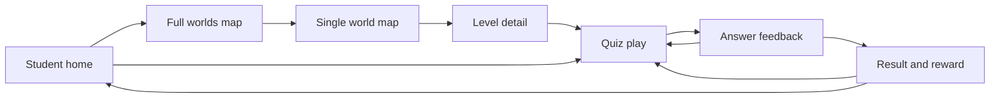

# Student App Wireframes

Date: 2026-05-10

## Summary

This document integrates the Week 3 screen specs into one student app flow. It is the source of truth for Week 4 implementation scope.

## Core Screen Order

1. Student home
2. Full worlds map
3. Single world map
4. Level detail
5. Quiz play
6. Answer feedback
7. Result and reward

## Integrated Flow

## Shared Components

| Need | Component |
| --- | --- |
| Primary commands | `Button` |
| Compact navigation | `IconButton` |
| Panels and summaries | `Card` |
| Status labels | `Badge` |
| Quiz/set progress | `ProgressBar` |
| Four choices | `QuizChoice` |
| Feedback and sync warnings | `FeedbackPanel` |

Future components to build in Week 4 or later:

- `StudentShell`
- `TodayPanel`
- `WorldCard`
- `SkillNode`
- `WorldMapLayout`
- `QuizLayout`
- `ResultLayout`

## CTA Priority Resolution

| Screen | Primary CTA | Secondary CTA |
| --- | --- | --- |
| Home | Start/continue current level | Open world map |
| Full worlds | Continue current world | Preview locked/open worlds |
| Single world | Start current node | Review completed nodes |
| Level detail | Start/review selected level | Return to map |
| Quiz | Select one of four choices | Back/home |
| Result | Next level or repair review | Home |

## State Matrix

| State | Home | Worlds | World detail | Quiz | Result |
| --- | --- | --- | --- | --- | --- |
| First visit | Start CTA | Addition open | Lv.1 current | Lv.1 playable | Starter reward |
| Returning | Continue CTA | Current highlighted | Current node highlighted | Continue set or start set | Next action from score |
| Review needed | Review CTA | Current world flagged | Review node badge | Repair hint | Review primary |
| Syncing | Play remains enabled | Quiet badge | Quiet badge | No block | Saving badge |
| Sync error | Local-safe copy | Local-safe copy | Local-safe copy | No block | Local-safe copy |
| Locked | Not primary | Text unlock clue | Disabled node with clue | Not reachable | Unlock preview only |

## Copy Decisions

- Keep `수포수포`, world names, and `Lv.` labels.
- Follow `학년명 노출 금지`: do not show grade labels in student-facing flows.
- Use repair language for mistakes.
- Save failure is not a learning failure.
- The current recommended action is always written as a verb.

## Responsive Decisions

- Mobile: one column, primary CTA in first viewport.
- Tablet: two-column layouts allowed for home/world screens only.
- Desktop: constrained student canvas; do not become a dense admin dashboard.

## Open Questions For Later

- Whether quiz auto-advance should become manual when reduced motion is enabled.
- Whether world unlock rules should be encoded in curriculum data or progress logic.
- Whether level detail becomes a modal or full route after route split.
